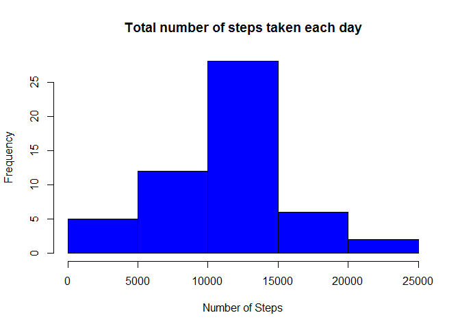
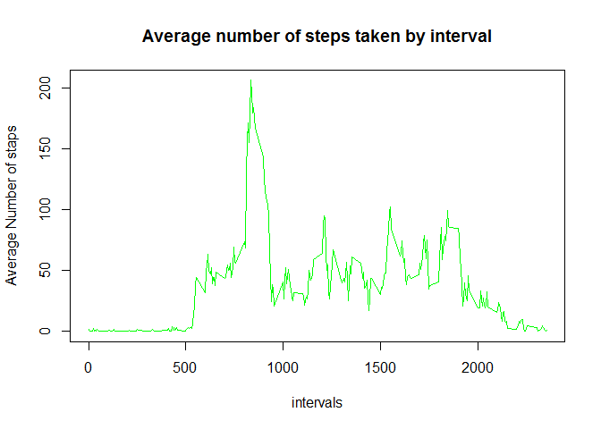
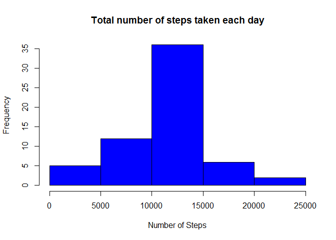
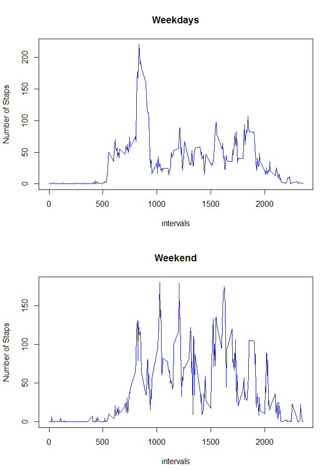

# Reproducible Research: Peer Assessment 1


### Loading and preprocessing the data


```r
data<- read.csv("activity.csv")
data$date <- as.Date(data$date)
```

### What is mean total number of steps taken per day? 


```r
sp<- aggregate(steps ~date, data=data , sum)
```
#### Make a histogram of the total number of steps taken each day

```r
par(mfrow =c(1,1))
hist(sp$steps, main = "Total number of steps taken each day",col="blue",xlab="Number of Steps")
```

<!-- -->

#### Calculate and report the **mean** and **median** total number of steps 
#### taken per day

```r
result.mean <- mean(sp$steps)
print(result.mean)
```

```
## [1] 10766.19
```

```r
result.median <-median(sp$steps)
print(result.median)
```

```
## [1] 10765
```
### What is the average daily activity pattern?


```r
sp1 <- aggregate(steps~interval, data=data, mean)
```

#### Make a  plot  of the 5-minute interval  and the average number of steps  taken

```r
plot(  y=sp1$steps,x=sp1$interval,type="l",col="green",xlab="intervals",ylab ="Average Number of staps" , main = "Average number of steps taken by interval")
```

<!-- -->

#### Which 5-minute interval, on average across all the days in the dataset, contains the maximum number of steps?

```r
result.max <- max(sp1$steps)
result.max.interval <- subset(sp1,sp1$steps == result.max)
print(result.max.interval)
```

```
##     interval    steps
## 104      835 206.1698
```
### Imputing missing values

#### Calculate and report the total number of missing values in the dataset

```r
sum_na <- sum(is.na(data$steps))
print(sum_na)
```

```
## [1] 2304
```
#### Filling in all of the missing values in the dataset

```r
data1 <- merge(data,sp1,by.x = "interval",by.y = "interval",all.x = TRUE)
data1<- data1 %>% mutate(steps= ifelse(is.na(steps.x), floor(steps.y), data1$steps.x))
```
#### Create a new dataset that is equal to the original dataset but with the  missing data filled in

```r
data1<- subset(data1,select=c(steps,date,interval))
```
#### Make a histogram of the total number of steps taken each day 

```r
sp2<- aggregate(steps ~date, data=data1 , sum)

hist(sp2$steps, main = "Total number of steps taken each day",col="blue",xlab="Number of Steps")
```

<!-- -->

#### Report the **mean** and **median** total number of steps taken per day. 
#### Do these values differ from the estimates from the first part of the assignment? 
#### What is the impact of imputing missing data on  the estimates of the total daily number of steps?

```r
result.mean_new <- mean(sp2$steps)
print(result.mean)
```

```
## [1] 10766.19
```

```r
print(result.mean_new)
```

```
## [1] 10749.77
```
##### Mean result became smaler, probably becouse of floor rounding

```r
result.median_new <-median(sp2$steps)
print(result.median)
```

```
## [1] 10765
```

```r
print(result.median_new)
```

```
## [1] 10641
```
##### Median became also smaler 
### Are there differences in activity patterns between weekdays and weekends?
#### Create a new factor variable in the dataset with two levels -- "weekday" and "weekend" 

```r
data3 <-data1
data3$v <-  weekdays(as.Date(data1$date))
data3$v <- ifelse(weekdays(as.Date(data1$date))=="Sunday" |weekdays(as.Date(data1$date))=="Saterday","weekend","weekday")
```
#### Make a panel plot of the 5-minute interval and the average number of steps taken
#### averaged across all weekday days or weekend days

```r
data_wd <- subset(data3, v=="weekday")
data_wd <- aggregate(steps ~interval, data=data_wd , mean)
data_wn <- subset(data3, v=="weekend")
data_wn <- aggregate(steps ~interval, data=data_wn , mean)
```

```r
par(mfrow =c(2,1))

plot(  y=data_wd$steps,x=data_wd$interval,type="l",col="blue",xlab="intervals",ylab ="Number of Staps" , main = "Weekdays")
plot(  y=data_wn$steps,x=data_wn$interval,type="l",col="blue",xlab="intervals",ylab ="Number of Staps" , main = "Weekend")
```

<!-- -->

